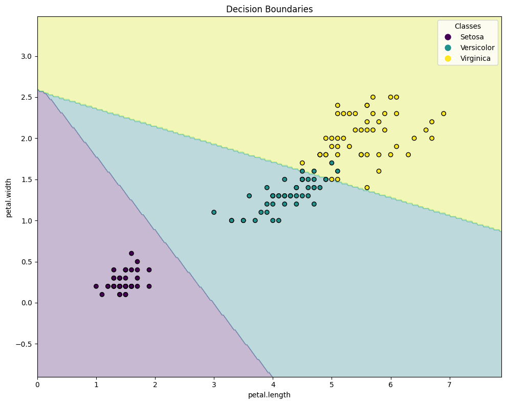

# Multi-class Perceptron assignment AI
Epoch 1: New best accuracy: 0.7079
Epoch 2: New best accuracy: 0.9775
Epoch 49: New best accuracy: 0.9888
Epoch 410: New best accuracy: 1.0000
Converged at epoch 411
Training completed. Best accuracy at epoch 410: 1.0000

Final Weights (Best):
Setosa: [ 1.12  -0.151 -0.431]
Versicolor: [ 0.78  -0.037 -0.304]
Virginica: [-1.9    0.188  0.735]

Classification Report:
Accuracy: 0.9333

Per-class metrics:
Setosa:
  Precision: 1.0000
  Recall: 1.0000
  F1-score: 1.0000
Versicolor:
  Precision: 1.0000
  Recall: 0.8333
  F1-score: 0.9091
Virginica:
  Precision: 0.8261
  Recall: 1.0000
  F1-score: 0.9048

Macro-average Precision: 0.9420
Macro-average Recall: 0.9444
Macro-average F1-score: 0.9380

